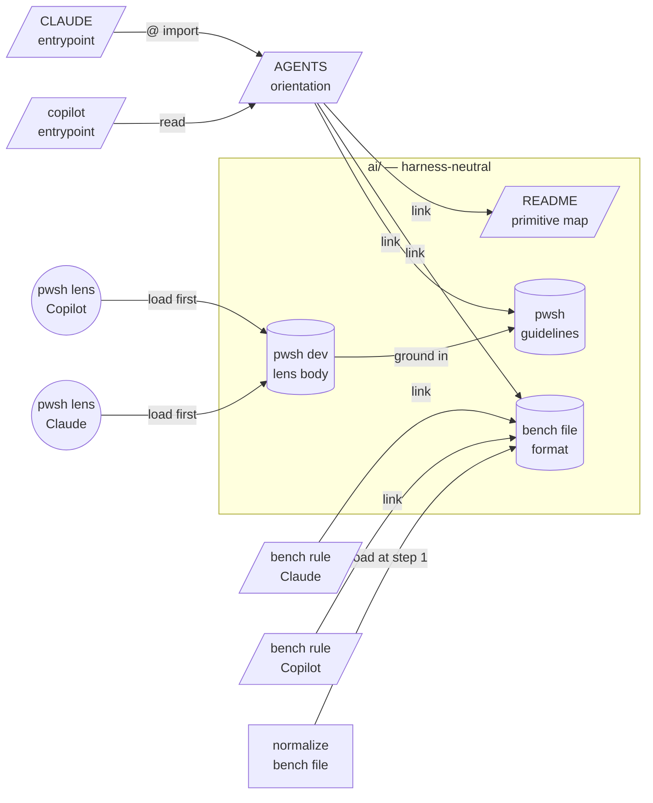

# Agent primitives — design record

Why this repo's AI-agent steering files are laid out the way they are.
Read it when **changing the layout** — moving a primitive, adding or
dropping a harness, or deciding where a new rule belongs. Ordinary work
on this project never needs it; [README.md](README.md) routes you to the
file that holds the rule you actually want.

Everything here is current and binding. Nothing in it is a record of
past state: how the layout was arrived at lives in git history.

Targets: **GitHub Copilot** and **Anthropic Claude Code**.

---

## 1. Intent and boundary

Give both harnesses the same project knowledge from a single canonical
copy of each fact, so guidance cannot drift between them. Every rule,
procedure, and lens body lives in exactly one file under `ai/`;
harness-specific files are thin entrypoints that point at it.

This design does **not**: change any application code, add a module
system or package manager, introduce orchestration or fan-out
topologies, or target harnesses beyond Copilot and Claude Code.

---

## 2. Portability facts

Verified against live vendor docs on 2026-07-22. **Re-verify before
relying on any row** — these surfaces move faster than this document.

| Primitive | Copilot reads | Claude Code reads | Portable? |
|---|---|---|---|
| Module entrypoint (skill) | `.github/skills/`, **`.claude/skills/`**, `.agents/skills/` | `.claude/skills/` | **YES** via `.claude/skills/` — see [section 4](#4-skill-location) |
| Persona (custom agent / subagent) | `.github/agents/*.agent.md`; VS Code also `.claude/agents/*.md` | `.claude/agents/*.md` | Partly — the Copilot CLI and cloud agent need `.github/agents/` |
| Always-on project rule | `AGENTS.md`, `CLAUDE.md`, `.github/copilot-instructions.md` | `CLAUDE.md` (+ `@path` imports) | Via `AGENTS.md` + a thin file per harness |
| Path-scoped rule | `.github/instructions/*.instructions.md` (`applyTo:`) | `.claude/rules/*.md` (`paths:`) | **NO** — one shim per harness |

Sources: <https://code.claude.com/docs/en/memory>,
<https://code.claude.com/docs/en/skills>,
<https://docs.github.com/en/copilot/concepts/agents/about-agent-skills>,
<https://docs.github.com/en/copilot/how-tos/configure-custom-instructions/add-repository-instructions>,
<https://code.visualstudio.com/docs/agent-customization/agent-skills>,
<https://code.visualstudio.com/docs/copilot/customization/custom-agents>.

Claude Code does not read `AGENTS.md`; its own docs prescribe a
`CLAUDE.md` containing `@AGENTS.md`. That single asymmetry is why
`AGENTS.md` is canonical and `CLAUDE.md` is a shim, not the reverse.

---

## 3. The module graph

Legend: `/box/` = scope-attached rule, `[box]` = module entrypoint
(skill), `((box))` = persona, `[(box)]` = asset.

Every arrow crossing out of a harness directory is a link the agent
follows with a tool call. The one exception is `CLAUDE.md`'s
`@AGENTS.md`, which the harness expands at launch.

### Interface sketch

| Module | Path | Type | Holds |
|---|---|---|---|
| primitive map | `ai/README.md` | asset | what `ai/` is; per-harness entrypoint locations; link-vs-import rule |
| bench rules | `ai/bench-file-format.md` | asset (canonical) | bench file structure, inheritance, tool patterns, cleanup |
| pwsh lens body | `ai/gh-workflow-pwsh-dev-lens.md` | asset (canonical) | grounding duty, in/out of scope, working rules, test command |
| pwsh guidelines | `ai/gh-workflow-pwsh-*-guidelines.md` | asset (canonical) | step-script rules; the `OrExit` failure pattern |
| design record | `ai/agent-primitives-design.md` | asset | this file |
| project orientation | `AGENTS.md` | rule (always on) | project facts; links into `ai/` |
| Claude entrypoint | `CLAUDE.md` | rule (always on) | `@AGENTS.md` + Claude-only notes |
| Copilot entrypoint | `.github/copilot-instructions.md` | rule (always on) | pointer to `AGENTS.md` and `ai/` |
| bench rule (Claude) | `.claude/rules/k0xbench.md` | rule (`paths:`) | glob + link |
| bench rule (Copilot) | `.github/instructions/K0xWorkbench.instructions.md` | rule (`applyTo:`) | glob + link |
| pwsh lens (Claude) | `.claude/agents/gh-workflow-pwsh-dev.md` | persona | frontmatter + link + boundary |
| pwsh lens (Copilot) | `.github/agents/gh-workflow-pwsh-dev.agent.md` | persona | frontmatter + link + boundary |
| normalize skill | `.claude/skills/normalize-bench-file/SKILL.md` | module entrypoint | procedure; loads `ai/bench-file-format.md` at step 1 |

Every `ai/` file is a local sibling of the entrypoints that link to it;
every entrypoint is self-contained. **External modules required: NONE** —
no manifest, no package resolution, nothing to break on clone.

---

## 4. Skill location

Verified 2026-07-22. Project-level skill roots, per harness:

| Harness | Roots read | Reads `.claude/skills/`? | Reads `.agents/skills/`? |
|---|---|---|---|
| Claude Code | `.claude/skills/` | yes (its **only** root) | **no** |
| GitHub Copilot | `.github/skills/`, `.claude/skills/`, `.agents/skills/` | yes | yes |
| Cursor | `.agents/`, `.cursor/`, `.claude/`, `.codex/` `skills/` | yes | yes |
| Codex | `.agents/skills/` (repo root) | **no** | yes |

`.agents/skills/` is the emerging vendor-neutral root. **Claude Code is
the only harness that does not read it.** So with Claude Code in the
target set, `.claude/skills/` is the unique intersection — a forced
choice, not a preference. Drop Claude Code and `.agents/skills/` becomes
strictly better.

### Why not mirror or symlink

- **Mirror (a copy in each root).** Copilot reads three roots and Cursor
  four, so a mirrored skill registers **twice** in those harnesses. Two
  dispatch entries with near-identical descriptions collide against each
  other, and whether either harness de-duplicates by `name` across roots
  is undocumented. Plus a second copy of the body to keep in sync — the
  duplication this whole design removes.
- **Stub that points at a canonical file.** Avoids body duplication but
  not the double registration, because the stub still needs its own
  `description` — that field *is* the dispatch signature. Costs an extra
  file read per invocation as well.
- **Symlink.** Claude Code explicitly supports a symlinked
  `<skill-name>` entry and loads the target once. But this is a
  Windows-only project: git creates symlinks on Windows only with
  Developer Mode or Administrator plus `core.symlinks=true`. A
  contributor cloning without those gets a text file containing a path,
  and the skill silently fails to load. Not acceptable as the default.

Runtime overhead of the chosen approach is nil: one file, read once when
invoked, no extra hop.

### Migration runbook

Skill and lens bodies are deliberately harness-neutral prose — no
`.claude/` paths, no harness-specific syntax inside them — so every case
below is a file move, not a rewrite.

| Change | Action |
|---|---|
| **Add Codex or another `.agents/`-only harness** | Move the skill folder to `.agents/skills/`, leave a symlink (or accept a copy) at `.claude/skills/` for Claude Code, and re-verify no double registration in Copilot. |
| **Add Cursor** | Nothing. Cursor already reads `.claude/skills/`. |
| **Drop Claude Code** | `git mv .claude/skills .agents/skills`; delete `.claude/rules/` and `.claude/agents/`; drop the `@AGENTS.md` line from `CLAUDE.md` or delete the file. `AGENTS.md` and everything in `ai/` are unchanged. |
| **Drop Copilot** | Delete `.github/copilot-instructions.md`, `.github/agents/`, and `.github/instructions/`. `AGENTS.md` and everything in `ai/` are unchanged. |

Both "drop" rows are cheap only because the canonical content lives in
`ai/`; dropping a harness deletes entrypoints, never content.

Re-verify the tables above before acting on any row.

---

## 5. Link, do not import

Claude Code expands `@path` imports into the session prefix **at
launch** — the memory docs state plainly that imports "help organization
but don't reduce context, since imported files load at launch". So an
import placed below the always-on layer would defeat the very laziness
that layer exists to provide:

- `@` in a path-scoped rule would risk loading the bench rules into
  every session, discarding the `paths:` gate. (Whether the expansion
  actually defers with the rule is undocumented; the failure is silent
  and expensive, so the design does not depend on the answer.)
- Subagent definition files are not memory files. The subagent docs
  specify `name`, `description`, `tools`, and `model` and describe no
  import syntax, so `@` in a persona would ship as literal text.
- A skill's `references/` are load-on-demand by construction.

Therefore: **`CLAUDE.md`'s `@AGENTS.md` is the only import in this
repo.** Everything else links, and the linking entrypoint says
explicitly that the link must be followed. Copilot has no import
mechanism at all, so this also keeps the two harnesses symmetric.

Consequence: no `ai/` file enters a session prefix unless the agent
opens it.

---

## 6. Standing decisions and rejections

Each carries the condition that would justify revisiting it.

- **`AGENTS.md` is canonical, not `CLAUDE.md`.** A vendor-named file as
  the neutral source has unclear precedence against
  `copilot-instructions.md` and excludes other agents. `AGENTS.md` is
  native to Copilot on GitHub.com and the coding agent, and is the
  documented Claude Code pattern via `@AGENTS.md`. *Revisit if* a target
  harness stops honoring the convention.
- **No `.agents/skills/` copy.** Claude Code does not read it
  ([section 4](#4-skill-location)), so the skill would silently vanish
  from one target; mirroring or stubbing re-registers it in the
  harnesses that read several roots. *Revisit if* Claude Code adds
  `.agents/skills/`, which collapses the whole question.
- **A skill body does not move to `ai/`.** Unlike a rule or a lens body,
  a skill's `description` *is* its dispatch signature, so the stub left
  behind cannot be content-free. Bodies are written as neutral prose
  instead, so relocation stays a file move.
- **`AGENTS.md` stays at the repository root, not in `ai/`.** Root is
  where every harness that honors the convention looks for it.
- **No path-scoped pwsh rule shims.** The pwsh guidance is reachable
  from always-loaded orientation and from both personas; two more shim
  files would split for no gain. *Revisit if* `AGENTS.md` hits its size
  budget and the pwsh section must be evicted.
- **No orchestrator or trigger primitive, and no fan-out.** Nothing here
  is event-driven, and the repo has one expert lens. The value is
  entirely in the module graph — depend, do not duplicate — plus one
  tool bridge so "the JSON still parses" is a fact rather than a claim.

---

## 7. Maintenance duties

**Invariants to preserve.** No file outside `ai/` states a rule; each
states only where the rule lives. Both persona files carry an identical
`description` — that is required, it is the dispatch signature — and
share nothing else beyond the boundary paragraph. Each shim keeps its
identity and out-of-scope statement inline, so a link the agent fails to
follow degrades to a less-grounded agent, not an unbounded one.

**After editing `ai/bench-file-format.md`,** re-run the content evals:

1. A bench file with backslash paths, three tools repeating the same
   `WorkingDirectory`, and two empty `Arguments` → expect forward
   slashes, a hoisted `DefaultWorkingDirectory`, empty properties
   removed, and JSON that still parses.
2. A nested-kit bench file where a child kit's `DefaultWorkingDirectory`
   equals its parent's → expect the redundant child value removed and
   inheritance preserved.
3. A JSON file that is not a bench file (no `Bench` root) → expect the
   skill to skip it and say why, not to edit it.

**After editing the normalize skill,** re-run those three against a real
fixture, and check the two constraints that a first draft got wrong and
that structural review did not catch:

- **The parse gate must use `System.Text.Json`, not
  `ConvertFrom-Json`.** PowerShell 7 accepts trailing commas; the app's
  loader (`K0x.DataStorage.JsonFiles`) does not. Verified directly:
  `ConvertFrom-Json` parsed `{ "Bench": { "Label": "x", } }` without
  complaint, while `JsonDocument.Parse` rejected it with "The JSON
  object contains a trailing comma".
- **Hoisting can silently change behavior.** Promoting a shared
  `WorkingDirectory` to a Kit's `DefaultWorkingDirectory` also changes
  the effective directory of every tool in that Kit that had none. The
  edits also have an ordering dependency: a nested Kit's value becomes
  redundant only after its parent's is hoisted.

**After changing the skill's `description`,** re-run the trigger evals.
Should fire: "normalize my bench file", "clean up K0xBench.json", "tidy
the workbench json", "fix the paths in my bench file", "hoist the
working directories in this kit", "my bench file has backslashes".
Should **not** fire: "format the C# code", "normalize the database
schema", "clean up the JSON serializer tests", "what is a Kit?".

---

## History

This layout was designed deliberately, in three passes, all on
2026-07-22 and all using the `genesis` design discipline.

- **Revision 1** established one canonical copy of each fact and
  replaced a Copilot-only prompt file with a skill both harnesses read.
- **Revision 2** moved every shared body into `ai/`, leaving the harness
  directories holding nothing but entrypoints.
- **Revision 3** routed the Copilot entrypoint through `ai/README.md`
  (it had pointed straight here, while `CLAUDE.md` pointed at the map)
  and reorganized this file around its binding decisions.

The findings behind each pass, and the state each one corrected, are in
git history. They are not restated here: this file describes what is
true now.
