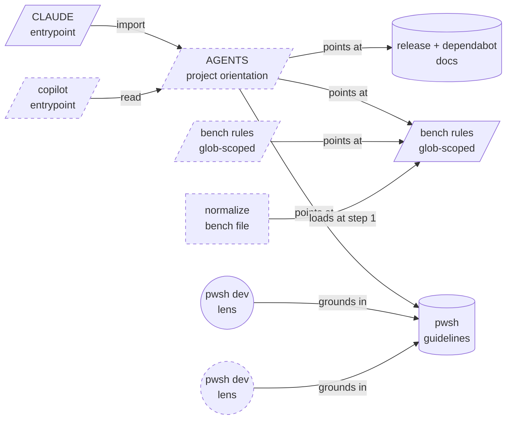
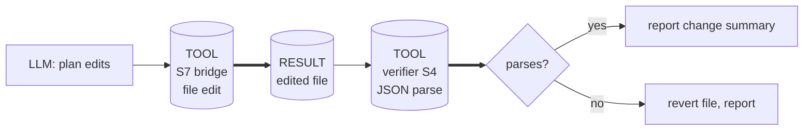
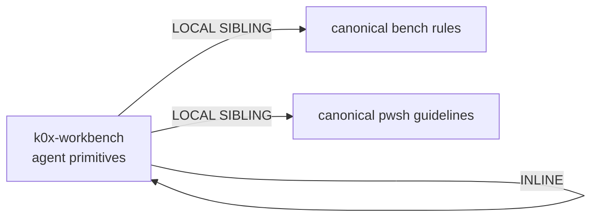

# Agent primitives — design handoff packet

Source of truth for how this repo's AI-agent steering files are
structured. Produced with the `genesis` design discipline. A future
refactor of these files starts from this packet, not from the emitted
markdown.

Targets: **GitHub Copilot** and **Anthropic Claude Code**.
Cost stance: `balanced` (no cap declared).

---

## 1. Intent and scope

Give both harnesses the same project knowledge from a single canonical
copy of each fact, so guidance cannot drift between them. Every rule,
procedure, and lens lives in exactly one file; harness-specific files
are thin entrypoints that point at it.

Boundary — this design does **not**: change any application code, add a
module system or package manager, introduce orchestration/fan-out
topologies, or target harnesses beyond Copilot and Claude Code.

### Portability facts the design rests on

Verified against live vendor docs on 2026-07-22. Re-verify before
relying on any row; these surfaces move.

| Primitive | Copilot reads | Claude Code reads | Portable? |
|---|---|---|---|
| Module entrypoint (skill) | `.github/skills/`, **`.claude/skills/`**, `.agents/skills/` | `.claude/skills/` | **YES** via `.claude/skills/` — see section 10 |
| Persona (custom agent / subagent) | `.github/agents/*.agent.md`; VS Code also `.claude/agents/*.md` | `.claude/agents/*.md` | Partly — CLI and cloud agent need `.github/agents/` |
| Always-on project rule | `AGENTS.md`, `CLAUDE.md`, `.github/copilot-instructions.md` | `CLAUDE.md` (+ `@path` imports) | Via `AGENTS.md` + a thin file per harness |
| Path-scoped rule | `.github/instructions/*.instructions.md` (`applyTo:`) | `.claude/rules/*.md` (`paths:`) | **NO** — one shim per harness |

Sources: <https://code.claude.com/docs/en/memory>,
<https://code.claude.com/docs/en/skills>,
<https://docs.github.com/en/copilot/concepts/agents/about-agent-skills>,
<https://docs.github.com/en/copilot/how-tos/configure-custom-instructions/add-repository-instructions>,
<https://code.visualstudio.com/docs/agent-customization/agent-skills>,
<https://code.visualstudio.com/docs/copilot/customization/custom-agents>.

Claude Code does not read `AGENTS.md`; its own docs prescribe a
`CLAUDE.md` containing `@AGENTS.md`. That single asymmetry is why
`AGENTS.md` is canonical and `CLAUDE.md` is a shim, not the reverse.

---

## 2. Component diagram



Legend: `/box/` = SCOPE-ATTACHED RULE, `[box]` = MODULE ENTRYPOINT
(skill), `((box))` = PERSONA, `[(box)]` = ASSET. Dashed = new.
`CM` (CLAUDE) is existing but fully rewritten. `PC` is the existing
Copilot persona; `PK` is its new Claude Code counterpart.

The deleted `normalize-bench-file` prompt file does not appear — `NS`
replaces it and serves both harnesses from one file.

---

## 3. Thread / sequence diagram

The emitted artifacts are static text with **no spawn topology**. The
only runtime sequence belongs to the one module entrypoint:

```mermaid
sequenceDiagram
    participant U as user turn
    participant T as single thread
    participant S as substrate (tools)
    U->>T: /normalize-bench-file (or discovery dispatch)
    T->>S: read canonical bench rules
    S-->>T: rules text
    T->>S: glob for *K0xBench.json
    S-->>T: candidate paths
    loop per file
        T->>S: read + edit file
        T->>S: parse JSON (S7 bridge)
        S-->>T: parse verdict
    end
    Note over T: single writer per file; no spawns, no fan-in
```

`A1 PANEL` is **rejected**: the lens count is 1 (bench-file
normalization), so the `>=3 independent lenses` gate never fires.
Fanning out would be PREMATURE SPLIT plus dispatcher cost for no
isolation win. Revisit only if the skill grows a second independent
lens (e.g. a security review of tool commands).

`A9 SUPERVISED EXECUTION` (weak form) **is** the shape, because the
skill mutates files the user cares about:



### Patterns selected

| Tier | Pattern | Where |
|---|---|---|
| R3 EXTRACT | duplicated rules lifted out of `CLAUDE.md` | orientation layer |
| R4 INLINE (rejected) | thin per-harness entrypoints kept | RUSHED INLINE exception: they are portability shims |
| A9 SUPERVISED EXECUTION (weak) | plan → edit → verify | normalize skill |
| S5 LAZY PROXY | `@AGENTS.md`; shims pointing at canonical files | entrypoints, rule shims |
| S6 RULE BRIDGE | constraints in rule files, voice in personas | pwsh + bench |
| S7 DETERMINISTIC TOOL BRIDGE | glob for files; parse JSON | normalize skill |
| S4 VALIDATION DECORATOR | parse gate before declaring done | normalize skill |
| C1 LAZY ASSET | bench rules load only at the step needing them | normalize skill |
| C2 PERSONA PRELOAD + GROUNDED EXPERT BRIEFING | persona must read its corpus before advising | pwsh persona |
| C4 DESCRIPTION DISPATCH | imperative, indirect-trigger descriptions | skill + personas |
| B13 CACHE-AWARE PREFIX | no dates/volatile facts in always-loaded files | AGENTS, CLAUDE |
| B14 PROMPT THRIFT | orientation file kept tight | AGENTS |

### 3.1 Tradeoff check

One slot had two candidates: **where canonical project orientation
lives**.

| Option | Copilot | Claude Code | Verdict |
|---|---|---|---|
| `CLAUDE.md` canonical | reads it natively | native | Rejected — vendor-named file as the neutral source; unclear precedence against `copilot-instructions.md`; excludes other agents |
| `AGENTS.md` canonical + per-harness shims | native (GitHub.com, coding agent); VS Code via setting, covered by the `copilot-instructions.md` shim | via `@AGENTS.md`, the documented pattern | **Chosen** |

Cited: grounding-doctrine matrix — pick the cell that guards the failure
mode (silent divergence between harnesses), not the fewest files.

### 3.2 Cost check

No spawns, no model bindings, no tool-catalogue changes; the emitted
artifacts are prefix text. The cost lever here is **prefix size**, not
routing.

| Module | Role class | Prefix band | Output band | Notes |
|---|---|---|---|---|
| AGENTS orientation | n/a (loaded text) | M — every session | n/a | budget < 200 lines; B14 thrift applied |
| CLAUDE entrypoint | n/a | XS | n/a | import + Claude-only notes only |
| copilot entrypoint | n/a | XS | n/a | pointer only |
| bench rules (canonical) | n/a | S — path-scoped, not every session | n/a | moved off the always-on path |
| bench rule shim | n/a | XS | n/a | pointer only |
| normalize skill | implementer | S — loads on invoke | S–M | one file at a time |
| pwsh personas | implementer | S — loads on select | S | grounding read is lazy |

Net effect vs today: ~15 lines of bench rules and ~8 lines of pwsh
rules leave the always-loaded Claude prefix and become path-scoped or
on-demand. B12 MODEL ROUTER is **not** applied — no fan-out exists, and
skill frontmatter does not carry `model:` on Copilot, so attempting it
would be WRONG-PRIMITIVE BINDING. B15 TOOL SUBSET is applied only where
a real subset exists (the personas), not as a full-surface list dressed
as an allowlist.

**PER-SPAWN DECLARATION TABLE: empty.** This design plans zero `task()`
spawns. Every artifact it emits is **EXTERNAL** audience (humans and
agents both read them), so all of them are NORMAL prose — caveman
compression (B14b/B14c) is explicitly not applicable and applying it
would be AUDIENCE BLEED.

### 3.5 Composition decision



| Box | Mode | Rationale |
|---|---|---|
| AGENTS orientation | INLINE | unique to this repo |
| CLAUDE / copilot entrypoints | INLINE | harness shims, no reuse |
| bench rules (canonical) | LOCAL SIBLING | consumed by the skill, the shim, and AGENTS |
| bench rule shim | INLINE | one consumer (Claude Code) |
| normalize skill | INLINE | repo-specific procedure |
| pwsh guidelines | LOCAL SIBLING | consumed by AGENTS and both personas |
| pwsh personas | INLINE | repo-specific lens |

**External modules required: NONE.** No manifest, no module-system
adapter at step 7b, no PHANTOM DEPENDENCY risk.

---

## 4. Findings on the current state (SoC + compliance pass)

| # | Finding | Severity | Cure |
|---|---|---|---|
| F1 | HIDDEN COUPLING — `CLAUDE.md` restates bench-file rules canonical in `.github/instructions/K0xWorkbench.instructions.md` | HIGH | R3 EXTRACT: delete the restatement, point at the canonical file |
| F2 | HIDDEN COUPLING — `CLAUDE.md` restates pwsh rules canonical in `docs/guidelines/*` | HIGH | R3 EXTRACT: same |
| F3 | CONTEXT GAP — project orientation (commands, architecture) exists only in a Claude-named file; Copilot's documented repo-instruction surface is absent | HIGH | new `AGENTS.md` + `.github/copilot-instructions.md` pointer |
| F4 | NON-PORTABLE TASK PRIMITIVE — `normalize-bench-file` shipped as a Copilot-only `.prompt.md` when Agent Skills are read by both harnesses | MEDIUM | relocate to `.claude/skills/normalize-bench-file/` |
| F5 | NAMED-NOT-GROUNDED EXPERT (C2 sub-rule) — the pwsh persona claims expertise and links two docs but never requires reading them | MEDIUM | add an explicit grounding step + citation duty |
| F6 | IMPLICIT FULL SURFACE dressed as an allowlist — the persona's `tools:` enumerates ~17 ids ≈ everything | LOW | narrow to a real subset |
| F7 | TERMINAL UNDERUSE / TOOLLESS ASSERTION — "Ensure JSON parses correctly" left as prose | MEDIUM | S7 bridge: parse via a tool call, S4-gate the write |
| F8 | PARITY GAP — no Claude-side path-scoped rule for bench files, now that `.claude/rules/` supports `paths:` globs | MEDIUM | add the shim |
| F9 | DESCRIPTION-AS-SUMMARY — the prompt file's description is declarative with no indirect triggers | LOW | rewrite imperative, name indirect triggers |
| F10 | BROKEN CROSS-REFERENCE — the prompt file tells the agent to apply a section called "Preferred patterns for common tools"; the instructions file's actual heading is "Preferred Tool Patterns" | LOW | fix the reference (evidence F1/F2 drift is already real) |
| F11 | STALE PROJECT MEMORY — the auto-memory `agent-primitives-architecture` describes a structure absent from the repo, and its rationale predates Copilot reading `.claude/skills` | LOW | rewrite the memory after implementation |

No BLOCKER findings. Design proceeds.

### Deliberate rejections (with revisit conditions)

- **No path-scoped pwsh rule shims.** The pwsh guidance is already
  reachable from always-loaded orientation and from both personas; two
  more shim files would be PREMATURE SPLIT. *Revisit if* the orientation
  file hits its size budget and the pwsh section must be evicted.
- **No `.github/skills/` copy of the skill.** Copilot reads
  `.claude/skills/`; a second copy would be DUPLICATED LEAF. *Revisit if*
  a Copilot surface is observed skipping `.claude/skills/`.
- **No orchestrator / trigger primitive.** Nothing here is event-driven.

---

## 5. Interface sketch per module

| Module | Path | Type | Trigger | Depends on |
|---|---|---|---|---|
| project orientation | `AGENTS.md` | rule (always on) | every session, both harnesses | pwsh guidelines, bench rules, release + dependabot docs |
| Claude entrypoint | `CLAUDE.md` | rule (always on) | every Claude Code session | `@AGENTS.md` |
| Copilot entrypoint | `.github/copilot-instructions.md` | rule (always on) | every Copilot request | `AGENTS.md` |
| bench rules | `.github/instructions/K0xWorkbench.instructions.md` | rule (glob `**/*K0xBench.json`) | Copilot touches a bench file | — |
| bench rule shim | `.claude/rules/k0xbench.md` | rule (paths `**/*K0xBench.json`) | Claude Code reads a bench file | bench rules |
| normalize skill | `.claude/skills/normalize-bench-file/SKILL.md` | module entrypoint | `/normalize-bench-file` or discovery, both harnesses | bench rules |
| pwsh lens (Copilot) | `.github/agents/workflow-pwsh-dev.agent.md` | persona | user selects the agent | pwsh guidelines |
| pwsh lens (Claude) | `.claude/agents/workflow-pwsh-dev.md` | persona | `Task` subagent selection | pwsh guidelines |

Invocation modes: orientation and rule files are runtime-injected (no
dispatch). The skill is **BOTH** (discovery + explicit `/` invocation) —
so its description must disambiguate hard. The personas are **FORCED**
(user or parent selects them), so their descriptions carry less
dispatcher risk.

Deleted: `.github/prompts/normalize-bench-file.prompt.md`.

---

## 6. Evals plan

**Content evals** (run with and without the skill; no measurable delta
means the skill is not earning its keep):

1. A bench file with backslash paths, three tools repeating the same
   `WorkingDirectory`, and two empty `Arguments` → expect forward
   slashes, a hoisted `DefaultWorkingDirectory`, empty properties
   removed, and JSON that still parses.
2. A nested-kit bench file where a child kit's `DefaultWorkingDirectory`
   equals its parent's → expect the redundant child value removed and
   inheritance preserved.
3. A JSON file that is not a bench file (no `Bench` root) → expect the
   skill to skip it and say why, not to edit it.

**Trigger evals** for the skill description — should fire: "normalize my
bench file", "clean up K0xBench.json", "tidy the workbench json", "fix
the paths in my bench file", "hoist the working directories in this
kit", "my bench file has backslashes". Should **not** fire: "format the
C# code", "normalize the database schema", "clean up the JSON
serializer tests", "what is a Kit?". Ship gate: fires on the first set,
stays silent on the second.

---

## 7. Todo list

1. Emit `AGENTS.md` (canonical orientation, no harness syntax). — no deps
2. Rewrite `CLAUDE.md` as a thin entrypoint. — depends on 1
3. Emit `.github/copilot-instructions.md` pointer. — depends on 1
4. Emit `.claude/skills/normalize-bench-file/SKILL.md`; delete the prompt file. — depends on bench rules being canonical
5. Emit `.claude/rules/k0xbench.md`; fix the broken heading reference (F10). — depends on 4's reference names
6. Harden `.github/agents/workflow-pwsh-dev.agent.md`; mirror it to `.claude/agents/workflow-pwsh-dev.md`. — no deps
7. Validate (step 8) and refresh the project memory. — depends on all

---

## 8. Human rationale

*(Never copied into a spawn brief — there are no spawns in this design.)*

The repo already had the right instinct: bench rules in a glob-scoped
instructions file, pwsh rules in neutral docs, a persona that points at
them. What it lacked was a single canonical orientation layer, so
`/init` filled `CLAUDE.md` with a summary of everything — and a summary
of a canonical file is a second copy of it. F10 shows the drift had
already started: the prompt file cites a section heading that no longer
exists.

The Agent Skills convergence is what makes the cleanup cheap now.
A year ago, a task primitive meant one file per harness. Today
`.claude/skills/` is read by both, and is slash-invocable on both, so
the prompt/command mirror pair collapses into one file. Path-scoped
rules are the only primitive that still needs a shim per harness, and
the shim is three lines pointing at the canonical rules.

The temptation worth naming: with genesis loaded it is easy to reach for
panels, routers, and orchestrators. None apply. This repo has one lens,
no fan-out, and no events. The value here is entirely in the module
graph — depend, do not duplicate — plus one tool bridge so "the JSON
still parses" is a fact rather than a claim.

---

## 9. Real-task refinement

The skill was run against a fixture bench file (backslash paths, three
tools sharing a `WorkingDirectory`, one URL tool with empty properties,
a nested Kit whose `DefaultWorkingDirectory` duplicated its parent's).
Two defects surfaced that review alone had missed, and both were fixed
in the emitted skill:

1. **The verification gate was too weak.** The draft used
   `ConvertFrom-Json`. PowerShell 7 accepts trailing commas, so the gate
   passed a file that `System.Text.Json` — what
   `K0x.DataStorage.JsonFiles` actually uses — rejects. Verified
   directly: `ConvertFrom-Json` parsed `{ "Bench": { "Label": "x", } }`
   without complaint; `JsonDocument.Parse` failed it with "The JSON
   object contains a trailing comma". The skill now calls
   `System.Text.Json` so the gate matches the app's loader.
2. **Hoisting could silently change behavior.** Promoting a shared
   `WorkingDirectory` to a Kit's `DefaultWorkingDirectory` also changes
   the effective directory of every tool in that Kit that had none — in
   the fixture, the URL tool. The skill's "behavior is invariant" rule
   did not say to check that, and the edits also have an ordering
   dependency (a nested Kit's value becomes redundant only after the
   parent's is hoisted). Both are now explicit judgement rules.

Neither would have been caught by structural lint. Re-run this pass
after any substantive edit to the skill.

---

## 10. Skill location: decision, alternatives, and migration

Verified 2026-07-22. Project-level skill roots, per harness:

| Harness | Roots read | Reads `.claude/skills/`? | Reads `.agents/skills/`? |
|---|---|---|---|
| Claude Code | `.claude/skills/` | yes (its **only** root) | **no** |
| GitHub Copilot | `.github/skills/`, `.claude/skills/`, `.agents/skills/` | yes | yes |
| Cursor | `.agents/`, `.cursor/`, `.claude/`, `.codex/` `skills/` | yes | yes |
| Codex | `.agents/skills/` (repo root) | **no** | yes |

`.agents/skills/` is the emerging vendor-neutral root. **Claude Code is
the only harness that does not read it.** So with Claude Code in the
target set, `.claude/skills/` is the unique intersection — a forced
choice, not a preference. Drop Claude Code and `.agents/skills/` becomes
strictly better.

### Why not mirror or symlink

- **Mirror (a copy in each root).** Copilot reads three roots and Cursor
  four, so a mirrored skill registers **twice** in those harnesses. Two
  dispatch entries with near-identical descriptions is DISPATCH
  COLLISION against yourself, and whether either harness de-duplicates
  by `name` across roots is undocumented. Plus a second copy of the body
  to keep in sync — the HIDDEN COUPLING this whole design removes.
- **Stub that points at a canonical file.** Avoids body duplication but
  not the double registration, because the stub still needs its own
  `description` (that field *is* the dispatch signature). Costs an extra
  file read per invocation as well.
- **Symlink.** Claude Code explicitly supports a symlinked
  `<skill-name>` entry and loads the target once. But this is a
  Windows-only project: git creates symlinks on Windows only with
  Developer Mode or Administrator plus `core.symlinks=true`. A
  contributor cloning without those gets a text file containing a path,
  and the skill silently fails to load. Not acceptable as the default.

Runtime overhead of the chosen approach is nil: one file, read once when
invoked, no extra hop.

### Migration runbook

The skill body is deliberately harness-neutral prose — no `.claude/`
paths, no harness-specific syntax inside it — so every case below is a
file move, not a rewrite.

| Change | Action |
|---|---|
| **Add Codex or another `.agents/`-only harness** | Move the skill folder to `.agents/skills/`, leave a symlink (or accept a copy) at `.claude/skills/` for Claude Code, and re-verify no double registration in Copilot. |
| **Add Cursor** | Nothing. Cursor already reads `.claude/skills/`. |
| **Drop Claude Code** | `git mv .claude/skills .agents/skills`; delete `.claude/rules/` and `.claude/agents/`; drop the `@AGENTS.md` line from `CLAUDE.md` or delete the file. `AGENTS.md` and the canonical rule documents are unchanged. |
| **Drop Copilot** | Delete `.github/copilot-instructions.md`, `.github/agents/`, and fold `.github/instructions/K0xWorkbench.instructions.md` into `.claude/rules/k0xbench.md` as canonical. |

Re-verify the table above before acting on any row; these surfaces move
faster than this document.
